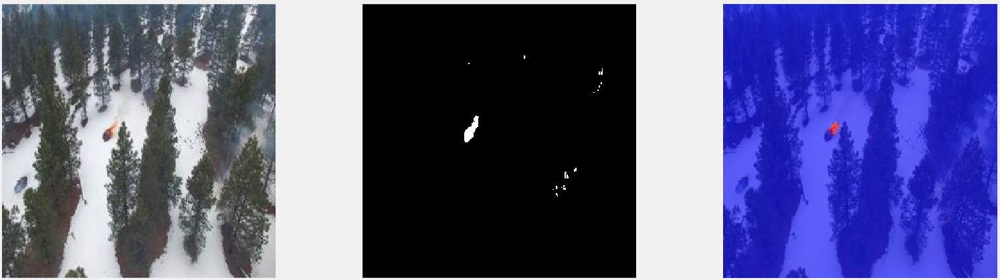
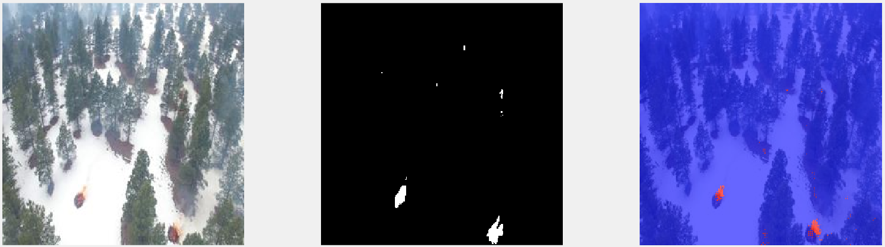
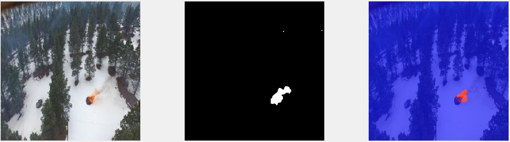

# fire-detection
This project will try to segment forest images taken by a drone, classifying each pixel by either forest or fire (segmentation technique)

## Overview
We will use a dataset of 2000 forest images in which there is fire (not in everyone) and the mask (each pixel classified, either forest or fire) of the images.
With those images we will try to segment every new image of a forest taken by a drone to detect fire, this will help firefighters to act fasters in a situation like this.

## Methodology
We will take 1600 images to train the model, and 400 to test it. A CNN is used in this cased to learn to detect fire in each image. This is the arquitecture:

1. Input Image:
   - Size: M x N x channels
   - Input layer receiving the image to classify.

2. Convolutional Layer:
   - 3x3 convolutional filter.
   - 32 filters.
   - Padding of 1 pixel.

3. ReLU Activation Function (Rectified Linear Unit):
   - Applies a ReLU activation function to the output of the convolutional layer.

4. Max Pooling Layer:
   - Reduces the spatial size of the input by a factor of 2.
   - Uses a 2x2 pool size and a stride of 2 pixels.

5. Transposed Convolutional Layer:
   - 4x4 transposed convolutional filter.
   - 32 filters.
   - Stride of 2 pixels.
   - Cropping of 1 pixel.

6. ReLU Activation Function:
   - Applies a ReLU activation function to the output of the transposed convolutional layer.

7. Convolutional Layer:
   - 1x1 convolutional filter.
   - 2 filters (output of 2 classes).

8. Softmax Activation Layer:
   - Applies the softmax activation function to the output of the last convolutional layer.

9. Pixel Classification Layer:
   - Name: pixelLabels.
   - Class names: class names.
   - Class weights: class weights.
   - Performs pixel classification into the defined classes.

## Results and conclusion

Here are some examples of the prediction in some test images, left one is the real image, second one the mask (solution) and third one the prediction given by the model:

## MATLAB dependencies
- Deep Learning Toolbox
- Image Processing Toolbox
- Computer Vision Toolbox

